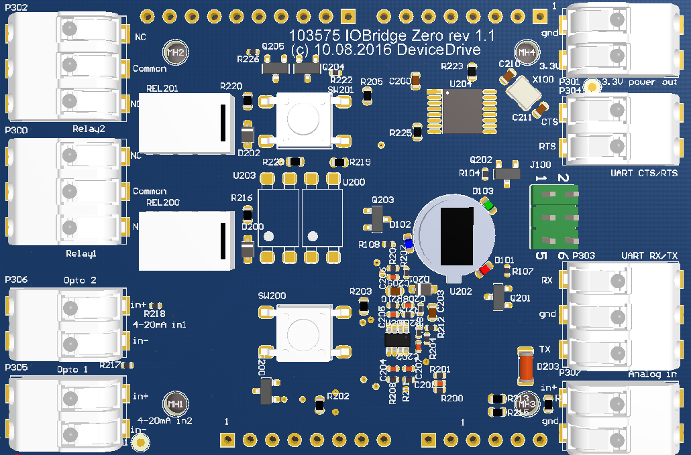
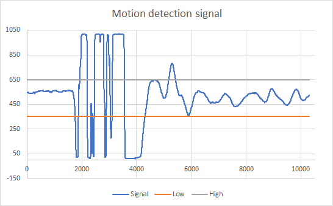

# IOBridgeLib

DeviceDrive IOBridge is an arduino zero shield which gives a developer access to a full range of different sensors and controllers.
The full feature list of DeviceDrive IOBridge includes:

 - Red, green and blue LED controlled by PWM
 - 2 Hardware buttons
 - 2 Relays
 - 2 Optocouplers
 - 1 Motion detector
 - 1 Temperature sensor (NTC)
 - Full UART interface
 - Analog to digital converter (3.3V)
 - 3.3 V output

This library creates an wrapper class for the DeviceDrive IOBridge. This document is designed to give the user a flying start with the library.
The user can choose between using the IOBridgeLib wrapper to setup all of the components automaticly or use each module speratly depending on 
the users needs

## Hardware
The IOBridge comes strapped with alot of different interfaces for users to utilize for their projects. This chapter summarizes all of the hardware spesific IO's:

### LEDs
There are 3 independent LED's on the IOBridge. There is 1 red, one blue and one green, each controlled by their own PWM.
This means that you can create a full RGB color spectrum.

|LED | Default pin |
|----|-------------|
|Red | Pin D10 |
|Green | Pin D12 |
|Blue | Pin D11 |

The following are public methods, accessable trough the IOBridgeLib framework:

    ///
    void led_setColor(int red, int green, int blue);
    /*
    * Sets parameters value to the PWM pins. Should be a value between 0 - 255.
    */

    ///
    void led_setColor(int red, int green, int blue, bool remember);
    /*
    * Sets parameters value to the PWM pins. Should be a value between 0 - 255. If remember = true,
    * then the Arduino will remember the last color when using blink or fade
    */

    ///
    void led_setColor(Color color);
    /*
    * Sets a Color, defined as a struct to the PWM pins. Predefined colors are available
    * and documented below.
    */

    ///
    void led_setColor(Color color, bool remember);
    /*
    * Sets a Color, defined as a struct to the PWM pins. Predefined colors are available
    * and documented delow. If remember = true, then the Arduino will remember the last color when using
    * blink or fade
    */

    ///
    void led_fadeTo(Color color);
    /*
    * Initiates a fade function to the color specified. Color is a defined struct. Predefined colors are available
    * and documented below. 
    * Note: This function is dependent on bridge.handle();
    */

    ///
    bool led_isFading();
    /*
    * Returns wheter or not the fading function is active.
    */

    ///
    void led_stopFade();
    /*
    * Will stop the fade function.
    */

    ///
    void led_startBlink(unsigned long interval);
    /*
    * Will start flashing the LED or LED's that are active with a color, with defined interval.
    * Node: This function is dependent on bridge.handle()
    */

    ///
    void led_stopBlink();
    /*
    * Will stop the blinking function
    */

    ///
    bool led_isBlinking();
    /*
    * Returns wheter or not the LED's are flashing.
    */

    ///
    Color led_getColor();
    /*
    * Returns the current color set as a Color struct
    */

##### Predefined colors

| Color | RGB value | static call |
|-------|-----------|-------------|
| Red | 255, 0 , 0 | Colors\::RED() |
| Orange | 255, 128, 0 | Colors\::ORANGE() |
| Yellow | 255, 255, 0 | Colors\::YELLOW() |
| Green | 0, 255, 0 | Colors\::GREEN() |
| Blue | 0, 0, 255 | Colors\::BLUE() |
| Cyan | 0, 255, 255 | Colors\::CYAN() | 
| Magenta | 255, 0, 255 | Colors\::MAGENTA() |

### Buttons
There are 2 hard buttons on the IOBridge. These are defined as SW200 and SW201. The library comes with two function callbacks for these buttons.
Both a short press and long press are supported by assigning callback functions to the .ion sketch.

|Button | Default pin |
|-------|-------------|
|SW200 | Pin D4 |
|SW201 | Pin A2 |
    
    ///
	void set_button_sw200_press_callback(ButtonPressedCallback * cb);
    /*
    * Set the button SW200 callback. The callback function must match the
    * typedef void ButtonPressedCallback()
    * Example: 
        bridge.set_button_sw200_press_callback(onPress);
        void onPress() {
            //Pressed
        }
    */

    ///
	void set_button_sw201_press_callback(ButtonPressedCallback * cb);
    /*
    * Set the button SW201 press callback. The callback function must match the
    * typedef void ButtonPressedCallback()
    * Example: 
        bridge.set_button_sw200_press_callback(onPress);
        void onPress() {
            //Pressed
        }
    */

    ///
	void set_button_sw200_longpress_callback(ButtonPressedCallback * cb);
    /*
    * Set the button SW200 long press callback. A long press is defined as 5 seconds. 
    * The callback function must match the
    * typedef void ButtonPressedCallback()
    * Example: 
        bridge.set_button_sw200_longpress_callback(onLongPress);
        void onLongPress() {
            //Pressed
        }
    */

    ///
	void set_button_sw201_longpress_callback(ButtonPressedCallback * cb);
    /*
    * Set the button SW201 long press callback. A long press is defined as 5 seconds.
    * The callback function must match the
    * typedef void ButtonPressedCallback()
    * Example: 
        bridge.set_button_sw200_longpress_callback(onLongPress);
        void onLongPress() {
            //Pressed
        }
    */

### Relays
There are two relays available on the board. These are named Relay1 and Relay2. The connectors on top support Normal Open and Normal Closed
for the developer. These relays tolerate 5A at 230V. 

|Relay | Default pin |
|-------|-------------|
| Relay1 | D2 |
| Relay2 | D3 |

    ///
	void relay_set_relay1_on();
    /*
    * Closes the Relay1 relay. Normal open will now lead power
    */

    ///
	void relay_set_relay1_off();
    /*
    * Opens the Relay1 relay. Normal closed will now lead power
    */

    ///
	void relay_set_relay2_on();
    /*
    * Closes the Relay2 relay. Normal open will now lead power
    */

    ///
	void relay_set_relay2_off();
    /*
    * Opens the Relay2 relay. Normal closed will now lead power
    */

    ///
	void relay_set_relay1_toggle();
    /*
    * Toggles the Relay1 relay. 
    */

    ///
	void relay_set_relay2_toggle();
    /*
    * Toggles the Relay2 relay.
    */

    ///
	bool relay_get_relay1();
    /*
    * Returns the current state of relay Relay1
    */

    ///
	bool relay_get_relay2();
    /*
    * Returns the current state of relay Relay2
    */

### Temperature sensor
The IOBridge comes with an NTC thermistor to read the current temperature on the board.
The coefficients for this NTC is already implemented in the library. 

The user can either read the current Celsius or Kelvin values of the sensor, or register a callback which fires
when the temperature changes by 1 degree centigrade since the last callback.

|NTC|Default Pin|
|-------|-------------|
| NTC | A4 |
    
    ///
	void temp_toggle_temperature_read();
    /*
    * Toggles the read of NTC pin. Must be enabled for temperature callback to fire.
    * Is also neccessary for the spot read of temperature.
    */

    ///
	double temp_read_celsius();
    /*
    * Returns the current temperature in centigrade.
    */

    ///
	double temp_read_kelvin();
    /*
    * Returns the current temperature in Kelvin.
    */

#### Callback
    ///
    void set_temperature_temperature_changed_callback(TemperatureChangedCallback *cb)
    /*
    * Sets the callback for temperature changed. Fires when temperature changes 1 degree centigrade,
    * since the last callback.
    * typedef void TemperatureChangedCallback(double temperature)
    * 
    * Example:
    *     bridge.set_temperature_temperature_changed_callback(onTempChanged);
    *     void onTempChanged(float temp) {
    *       Serial.println(temp);
    *     }
    */

### Motion sensor
The motion sensor on the board is mounted center between the LED's. It should be covered with the supplied lens at all times.
This library implements the motion detector with some default values and methods. The user can register a callback for both registerd motion
and optionally a callback to fire when theres no movement in the vicinity.

The motion sensor is controlled by an output signal on the MOTION_DETECTOR_ENABLE pin. This signal must be LOW to enable the sensor. A HIGH value
will disable the sensor.

    Note: After the MOTION_DETECTOR_ENABLE has been set LOW, the sensor needs 10 - 20 seconds to stabilize.
This library will enable the sensor by default when the IOBridgeLib is initiated.

The library also implements a simple smoothing algorithm that averages the motion levels over 10 meassurements to avoid false alarms on
spikes.

The default values for detection is set to 350(LOW) and 600(HIGH). All registerd values between these limits are defined as "NO movement".
If the value goes over or under this preset, the library assumes Movement. See this picture for an example.

|Motion sensor| Pin|
|-------|-------------|
| MOTION_DETECTOR_ENABLE | A1 |
| MOVEMENT_DETECTOR_READ_PIN | A3 |  
    
    ///
    void motion_set_movement_levels(float low, float high);
    /*
    * Default movement levels are 350 low to 600 high. If this window is to narrow (Motion is triggerd to fast), increase the gap
    */

    ///
	void motion_enable_movement_sensor();
    /*
    * Enables the read routine for the sensor, and activates the callbacks. Does noting to the MOTION_DETECTOR_ENABLE pin.
    */

    ///
	void motion_disable_movement_sensor();
    /*
    * Disables the read routine for the sensor, and deactivates the callbacks. Does nothing to the MOTION_DETECTOR_ENABLE pin.
    */

    ///
	float motion_get_current_movement();
    /*
    * Returns the current read from the motion sensor if you want to implement your own routines for the handeling of motion detection.
    */

    #### Callback
    ///
    void set_motion_detector_on_motion_callback(MotionDetectedCallback *cb);
    /*
    * Sets the callback to be called when the motion detector triggers
    * typedef void MotionDetectedCallback();
    * 
    * Example:
    *     bridge.set_motion_detector_on_motion_callback(onMotion);
    *     void onMotion() {
    *       Serial.println("Detected motion");
    *     }
    */

    ///
    void set_motion_detector_on_no_motion_callback(MotionDetectedCallback *cb);
    /*
    * Sets the callback to be called when the motion detector has not detected motion for 5 seconds
    * typedef void MotionDetectedCallback();
    * 
    * Example:
    *     bridge.set_motion_detector_on_no_motion_callback(onNoMotion);
    *     void onNoMotion() {
    *       Serial.println("No motion detected anymore");
    *     }
    */

### Optocouplers
The board has two optocouplers to be used as digital inputs. As mounted they will give a HIGH signal on read pins withing the range of 3.00V - 10.0V.
Below 1.2V the signal will be LOW. Between 1.2V and 3.0V is undefined.

The sensors has an internal voltage drop of 1.2V and the mounted resistor is 470Ohm. The sensors are active from 4-20mA.
   
To increase the supported input voltage, add a resistor in series on your input.
    
    Example:
        To support 15V input on the optocoupler:
        15V - 1.2V = 13.8V
        by pushing 15V through, it gives 20mA
        Ohm's law: R = U / I
        R = 13.8V / 0.020A = 690 Ohm
        Subtract existing 470 Ohm:
        690 - 470 = 220 Ohm

        Add the 220 Ohm in series on Opto + input.

|Optocouplers| Pin |
|-------|-------------|
| Opto one | D13 |
| Opto two | A0 |
    
    ///
    int opto_one_get_current_state();
    /*
    * Returns the current digital state of the optocoupler ONE
    */

    ///
	int opto_two_get_current_state();
    /*
    * Returns the current digital state of the optocoupler TWO
    */

#### Callback
    ///
    void set_opto_one_state_changed_callback(TemperatureChangedCallback *cb)
    /*
    * Sets the callback for state of optocoupler ONE input.
    * typedef void OptoCouplerCallback(int value)
    * 
    * Example:
    *     bridge.set_opto_one_state_changed_callback(onStateChanged);
    *     void onStateChanged(int state) {
    *       Serial.println(state);
    *     }
    */

    ///
    void set_opto_two_state_changed_callback(TemperatureChangedCallback *cb)
    /*
    * Sets the callback for state of optocoupler TWO input.
    * typedef void OptoCouplerCallback(int value)
    * 
    * Example:
    *     bridge.set_opto_two_state_changed_callback(onStateChanged);
    *     void onStateChanged(int state) {
    *       Serial.println(state);
    *     }
    */

### Analog In (ADC)
The IOBridge has an analog ADC input available.
The value will be bteeen 0 and 1024, based on the input voltage. The voltage range is from 0V-3.3V

|ADC| Pin |
|-------|-------------|
| ADC_REMOTE | A5 |

    ///
    float adc_get_current_value();
    /*
    * Returns the current ADC value.
    */

### UART

    #######################################
    
    NOT YET IMPLEMENTED IN THIS LIBRARY

    #######################################

The IOBridge has a full UART port you can utilize. It is operated and controlled over the SPI
port on the Arduino. 

### 3.3V Output

Based on the number and shields limits the output power of this port, but you can assume 100-200mA available
at 3.3V